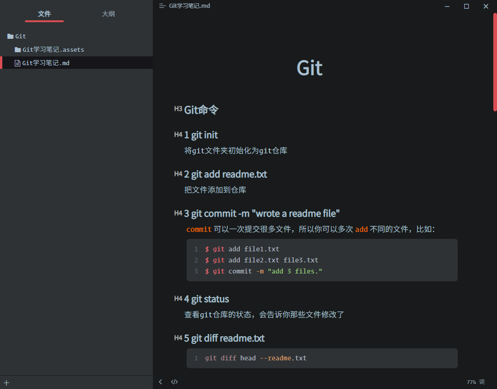
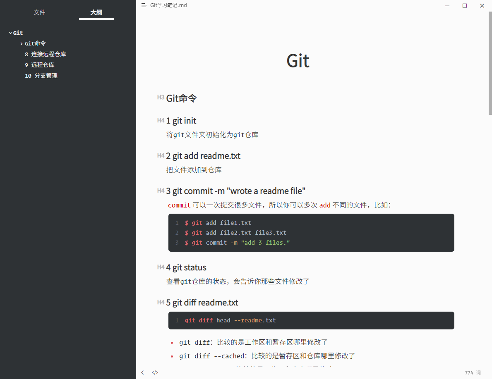

# typora-theme-FloraDark

 
    
    

**声明**：本主题是在[typora-theme-flora](https://github.com/wnanbei/typora-theme-flora)主题基础上做的修改，在此感谢原作者[wnanbei](https://github.com/wnanbei)。

**由来**：一直在用flora这款主题，碰巧看到原主题github上有人发了[issue](https://github.com/wnanbei/typora-theme-flora/issues/4)求黑色主题，下手改了一个。改完发现原主题有[bug](https://github.com/wnanbei/typora-theme-flora/issues/3)，也一并解决了。所以本主题可以放心使用。

**相比原主题的变动**：

1. 调大了字体，以及适配各种小符号。
2. 修改了原主题的代码样式，以及一些代码选择、光标所在行背景颜色，语言选择。（原主题代码中会出现大片红色，显得很乱）
3. 修改表格，增加分割线及表头深色显示。
4. 在此基础上增加了黑色主题并修复了bug。

### Dark Preview

### Light Preview

这部分在原主题的基础上，主要做的工作有：

1. 调大了字体
2. 表格添加分割线，并且加深表头颜色
3. 代码块的渲染颜色

### 安装方法

1. 通过Typora的**设置->主题->打开主题文件夹**，来打开文件夹。
2. 将`flora文件夹`、`flora-hans.css`以及`flora-dark.css`复制到typora的主题文件夹下。
3. 重启Typora，就可以选择新的FloraDark主题了。

如果有帮助到您，请帮忙点个star，这对我很重要，谢谢。